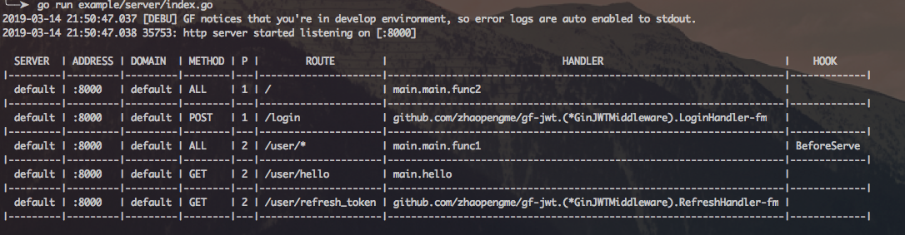
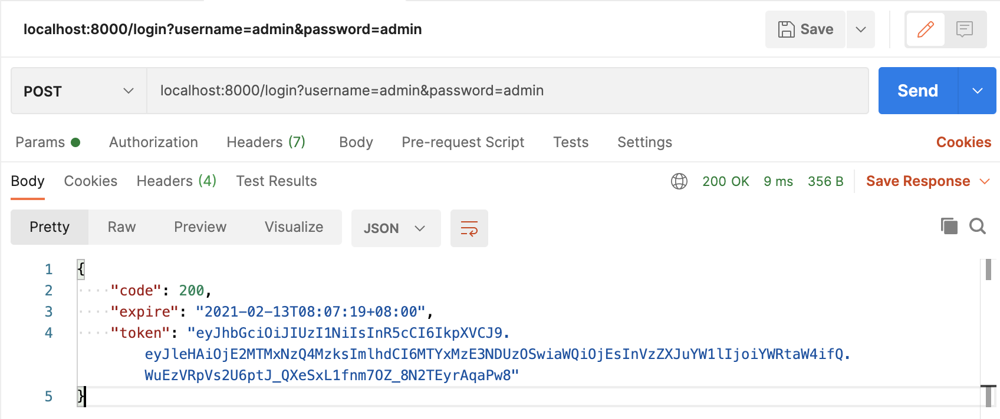
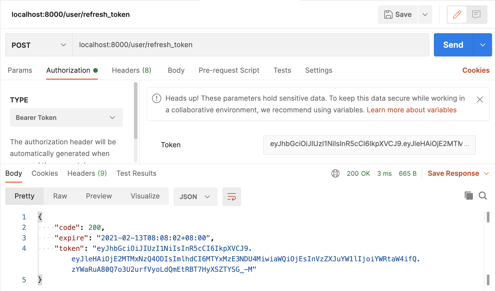
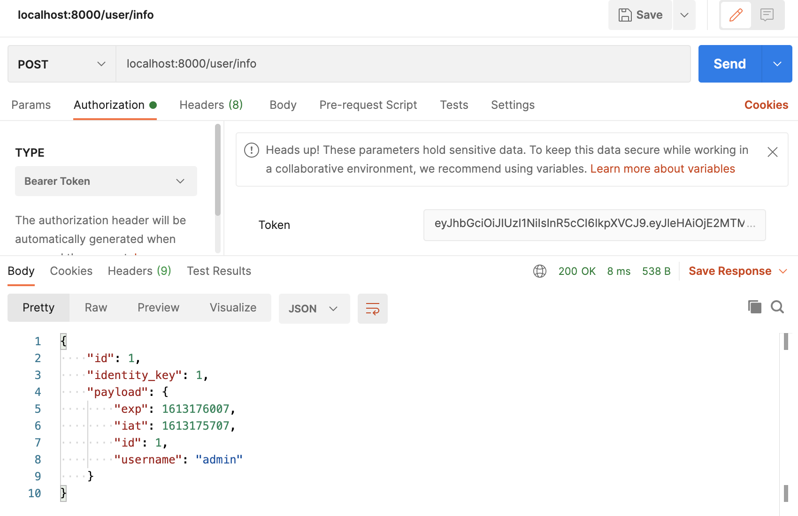
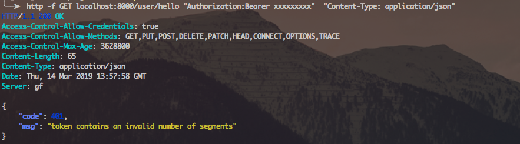

# gf-jwt
基于GoFrame框架的JWT认证
## 使用

下载安装

```sh
$ go get github.com/kotlin2018/jwt
```

导入

```go
import "github.com/kotlin2018/jwt"
```

## 参数说明
`claims["expire"]` token的过期时间.

`Claims["current_time"]` 生成token的当前时间.

`r.SetParam("JWT_Payload", claims)` 将有效载荷设置到请求中.

`r.GetString("Jwt_Token")`.

`请求头中的Authorization字段保存token的值`.

## 例子

查看示例 [example/auth/auth.go](example/auth/auth.go) , 使用 `ExtractClaims` 可以自定义用户数据.

[embedmd]:# (example/auth/auth.go go)

## Demo

运行 `example/server/server.go` 在 `8000`端口.

```bash
$ go run example/server/server.go
```



通过 [httpie](https://github.com/jkbrzt/httpie) ,在命令行来测试下效果.

### 登录接口:

```bash
$ http -v --form  POST localhost:8000/login username=admin password=admin
```

命令行输出



### 刷新 token 接口:

```bash
$ http -v -f GET localhost:8000/user/refresh_token "Authorization:Bearer xxxxxxxxx"  "Content-Type: application/json"
```

命令行输出



### info 接口

我们使用用户名 `admin` 和密码 `admin` 测试一下 info 接口的返回

```bash
$ http -f GET localhost:8000/user/info "Authorization:Bearer xxxxxxxxx"  "Content-Type: application/json"
```

命令行输出



### 用户验证接口

我们用未授权的 token 来测试 info 接口的返回

```bash
$ http -f GET localhost:8000/user/info "Authorization:Bearer xxxxxxxxx"  "Content-Type: application/json"
```

命令行输出




再次感谢[https://github.com/appleboy/gin-jwt](https://github.com/appleboy/gin-jwt)。